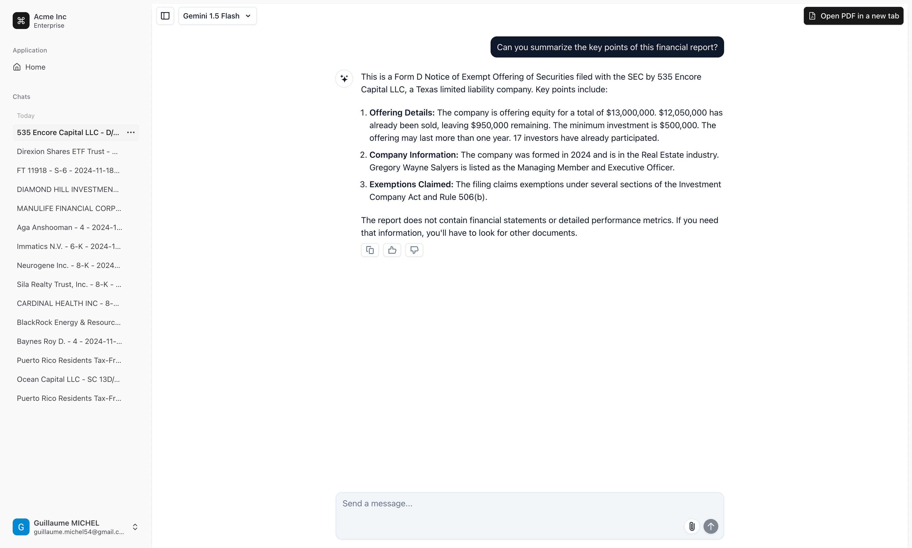

# GCPU Hackathon - Financial Report Insights

[Live Deployment on Vercel](https://gcpu-hackathon-pg5p7ark5-guillaume-michels-projects-b8350f77.vercel.app)

> ⚠️ **Note**: The deployment is hosted in the US, which may introduce some lag.

## Overview

This project was created as part of the GCPU Hackathon to showcase how AI and cloud technologies can enhance financial analysis. The application allows users to explore and interact with financial reports through an intelligent chatbot powered by Gemini 1.5 Flash/Pro.

---

## Features

1. **Interactive Chatbot**  
   Ask questions and receive insights about financial reports, leveraging the power of Gemini 1.5 Flash/Pro.

2. **Data Storage with Google Cloud**
    - **Cloud Storage**: Stores the PDFs of financial reports.
    - **BigQuery**: Stores metadata and detailed information about financial reports.

3. **API Backend**  
   A Go-based API deployed on **Google Cloud Kubernetes Engine**, responsible for handling:
    - PDF uploads.
    - Storage of financial data in BigQuery and Cloud Storage.

4. **Financial Report Fetching**
    - Reports and PDFs are sourced from [SEC API](https://sec-api.io/login).

5. **User-Friendly Web Interface**  
   Built with **Next.js**, the site provides an intuitive UI for interacting with financial data and AI-powered insights.

---

## Architecture


### Backend
- **Google Cloud Kubernetes Engine**: Scalable deployment for our Go-based API.
  
- **Cloud Storage**: Secure and scalable storage for PDFs.
- **BigQuery**: Handles structured storage and queries for financial data.

### Frontend
- **Next.js**: React framework for a dynamic and interactive user interface.

### AI Integration
- **Gemini 1.5 Flash/Pro**: Provides intelligent insights and analysis for financial reports.

### External Data Source
- **SEC API**: Supplies raw financial reports and metadata.

---

## How It Works

1. **Upload Reports**  
   Upload financial reports in PDF format. Files are stored securely in Cloud Storage.

2. **Analyze Data**  
   Metadata from reports is extracted and saved in BigQuery for structured analysis.

3. **Chat with the AI**  
   Users can ask questions about the reports and get detailed answers from Gemini AI.

---

## Screenshots

### Homepage


### Chatbot Interaction




---

## Deployment

The application is deployed on:
- **Frontend**: [Vercel](https://gcpu-hackathon-pg5p7ark5-guillaume-michels-projects-b8350f77.vercel.app)
- **Backend**: Google Cloud Kubernetes Engine

---

## How to Run Locally

### Prerequisites
1. **Google Cloud Setup**:
    - Cloud Storage bucket.
    - BigQuery dataset.
    - API keys for SEC API and Gemini.

2. **Node.js and Go**:
    - Install [Node.js](https://nodejs.org/) for the frontend.
    - Install [Go](https://golang.org/) for the API backend.

3. **Next.js**:
    - Install dependencies: `npm install`

### Steps
1. Clone the repository:
   ```bash
   git clone https://github.com/michelguillaume/GCPU-Hackathon.git
   ```
2. Navigate to the project directory and run the frontend:
   ```bash
   cd my-app
   npm run dev
   ```
3. Start the backend API locally:
   ```bash
   cd FilingManager
   go run main.go
   ```

---

## Contributors

- Guillaume Michel


---
